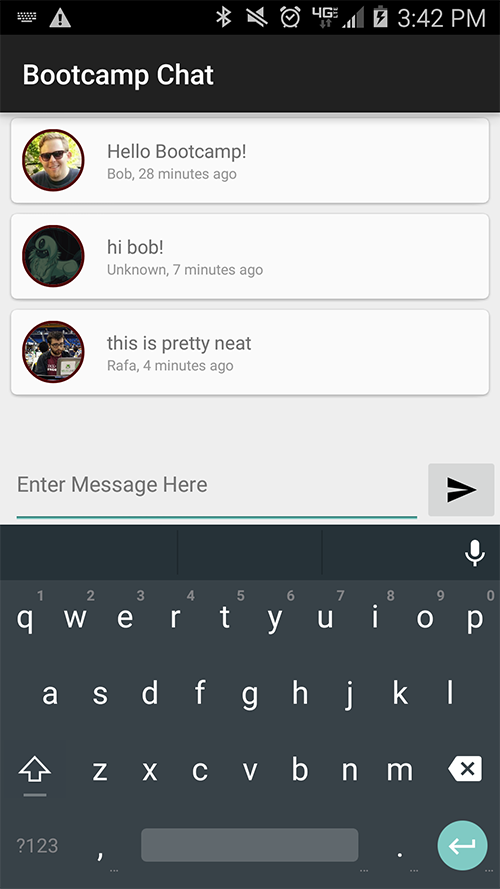

# Android Bootcamp
We built an app to help teach students about Android. A chat client is what we came up with as it is highly interactive and involves some cool web components too!

## Instructors
* Bob Timm      /bajabob
* Rafa Moreno   /ralphie9224

## Purpose & Goals
This application was developed as a means to teach students about building their first Android application in a 4 hour timespan. If you are interested in teaching a similar course, please reach out to either one of us for our course materials. This application aims to teach students about:
* RESTFul web services
* Android basics
* Coding conventions

## New to Android?
Reach out to us! We would be glad to help you get started. 

## License
Copyright (c) 2015 Bob Timm

Permission is hereby granted, free of charge, to any person obtaining a copy of this software and associated documentation files (the "Software"), to deal in the Software without restriction, including without limitation the rights to use, copy, modify, merge, publish, distribute, sublicense, and/or sell copies of the Software, and to permit persons to whom the Software is furnished to do so, subject to the following conditions:

The above copyright notice and this permission notice shall be included in all copies or substantial portions of the Software.

THE SOFTWARE IS PROVIDED "AS IS", WITHOUT WARRANTY OF ANY KIND, EXPRESS OR IMPLIED, INCLUDING BUT NOT LIMITED TO THE WARRANTIES OF MERCHANTABILITY, FITNESS FOR A PARTICULAR PURPOSE AND NONINFRINGEMENT. IN NO EVENT SHALL THE AUTHORS OR COPYRIGHT HOLDERS BE LIABLE FOR ANY CLAIM, DAMAGES OR OTHER LIABILITY, WHETHER IN AN ACTION OF CONTRACT, TORT OR OTHERWISE, ARISING FROM, OUT OF OR IN CONNECTION WITH THE SOFTWARE OR THE USE OR OTHER DEALINGS IN THE SOFTWARE.
